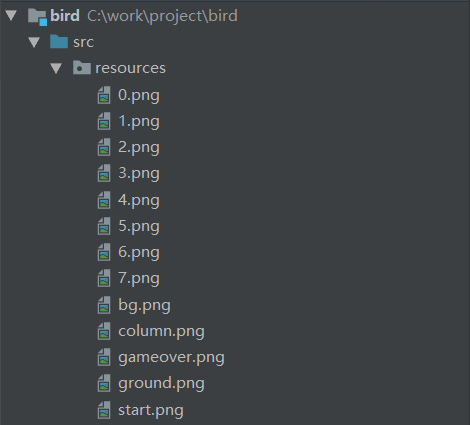
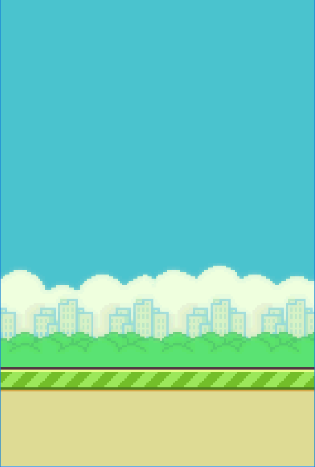
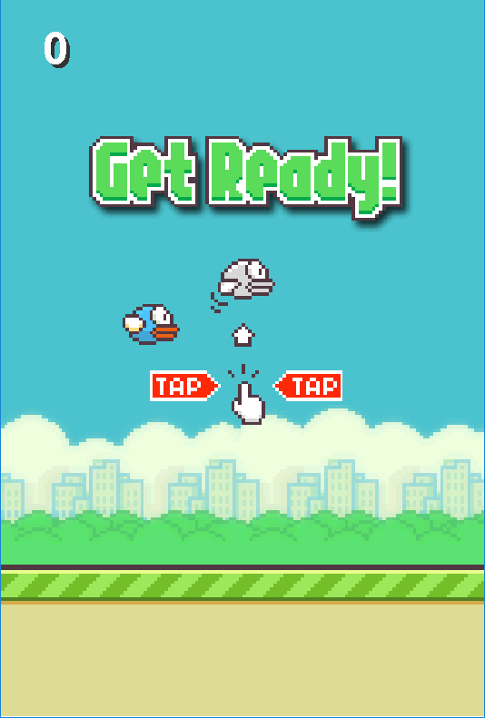
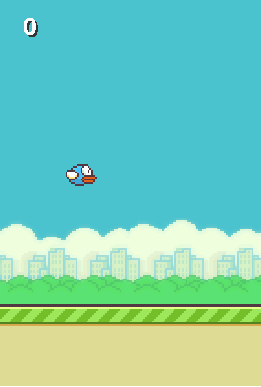
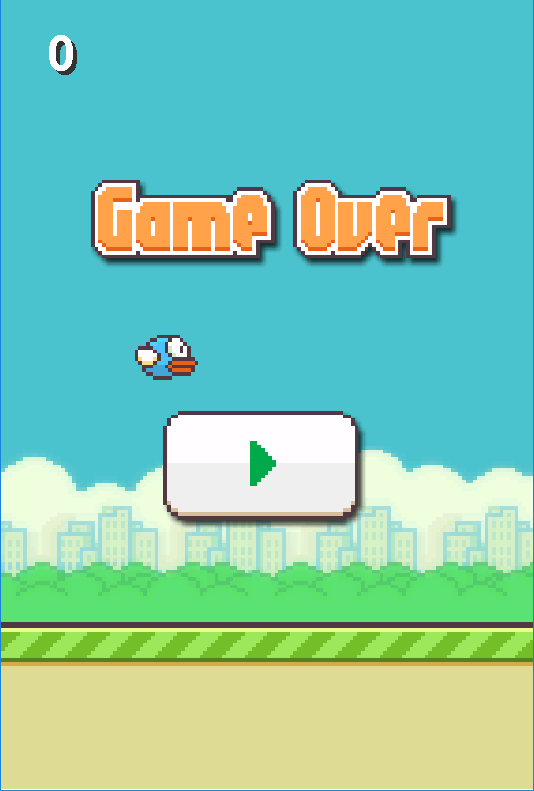
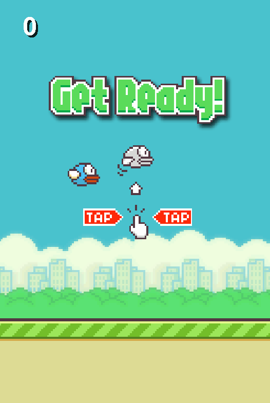
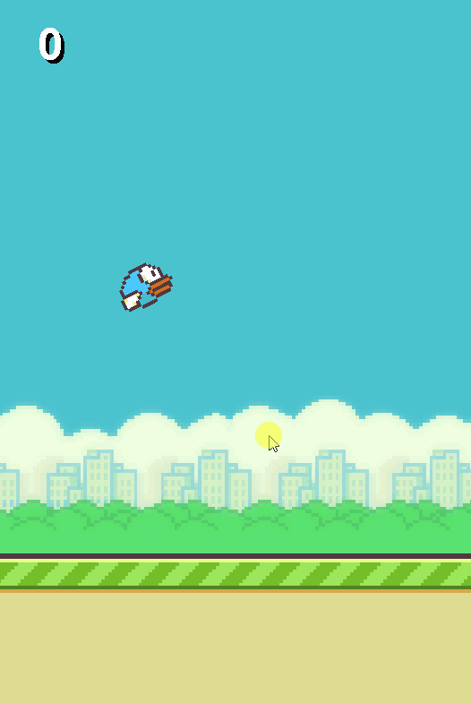

# 《飞扬的小鸟》开发教程

《飞扬的小鸟》是一款曾经风靡一时的虐心小游戏，在本教程的帮助下，你可以从零开始，一步一步的开发出这款小游戏。在开发之前，请先明确以下内容：

- 开发语言

  Java，主要应用Java的基本语法，Java面向对象的三大特征，以及Java Swing的常见API。

- 开发工具

  JDK8，或者更高版本的JDK。

- 注意事项

  开发前，先下载游戏素材。开发时，会使用到一些参数，如坐标、尺寸、速度等。这些参数的值是作者根据经验得出的结论，你可以直接使用这些参数值，也可以尝试自定义这些参数值。


## 一、创建游戏面板

### 1. 创建项目

创建Java项目（bird），在src路径下新建resources目录，并导入所有素材图片，如下图：




### 2. 绘制面板

创建game包，并在此包下创建游戏面板类BirdGame，在该类中增加如下代码：

```java
package game;

import javax.imageio.ImageIO;
import javax.swing.*;
import java.awt.*;
import java.awt.image.BufferedImage;

/**
 * 游戏界面
 */
public class BirdGame extends JPanel {

    // 背景图片
    BufferedImage background;

    /**
     * 初始化游戏
     */
    public BirdGame() throws Exception {
        // 初始化背景图片
        background = ImageIO.read(getClass().getResource("/resources/bg.png"));
    }

    /**
     * 绘制界面
     */
    public void paint(Graphics g) {
        // 绘制背景
        g.drawImage(background, 0, 0, null);
    }

    /**
     * 启动方法
     */
    public static void main(String[] args) throws Exception {
        JFrame frame = new JFrame();
        BirdGame game = new BirdGame();
        frame.add(game);
        frame.setSize(440, 670);
        frame.setLocationRelativeTo(null);
        frame.setDefaultCloseOperation(JFrame.EXIT_ON_CLOSE);
        frame.setVisible(true);
    }

}
```


### 3. 测试一下

运行main方法，效果如下图：




## 二、设计游戏道具

### 1. 设计地面

定义地面类（Ground），代码如下：

```java
package game;

import javax.imageio.ImageIO;
import java.awt.image.BufferedImage;

/**
 * 地面
 */
class Ground {

    // 图片
    BufferedImage image;
    // 位置
    int x, y;
    // 宽高
    int width, height;

    // 初始化地面
    public Ground() throws Exception {
        image = ImageIO.read(getClass().getResource("/resources/ground.png"));
        width = image.getWidth();
        height = image.getHeight();
        x = 0;
        y = 500;
    }

    // 向左移动一步
    public void step() {
        x--;
        if (x == -109) {
            x = 0;
        }
    }

}
```


### 2. 设计柱子

定义柱子类（Column），代码如下：

```java
package game;

import javax.imageio.ImageIO;
import java.awt.image.BufferedImage;
import java.util.Random;

/**
 * 柱子
 */
class Column {

    // 图片
    BufferedImage image;
    // 位置
    int x, y;
    // 宽高
    int width, height;
    // 柱子之间的缝隙
    int gap;
    // 柱子之间的距离
    int distance;
    // 随机数工具
    Random random = new Random();

    /**
     * 初始化第N个柱子
     */
    public Column(int n) throws Exception {
        image = ImageIO.read(getClass().getResource("/resources/column.png"));
        width = image.getWidth();
        height = image.getHeight();
        gap = 144;
        distance = 245;
        x = 550 + (n - 1) * distance;
        y = random.nextInt(218) + 132;
    }

    // 向左移动一步
    public void step() {
        x--;
        if (x == -width / 2) {
            x = distance * 2 - width / 2;
            y = random.nextInt(218) + 132;
        }
    }
}
```


### 3. 设计小鸟

定义小鸟类（Bird），代码如下：

```java
package game;

import javax.imageio.ImageIO;
import java.awt.image.BufferedImage;

/**
 * 小鸟
 */
class Bird {

    // 图片
    BufferedImage image;
    // 位置
    int x, y;
    // 宽高
    int width, height;
    // 大小（用于碰撞检测）
    int size;

    // 重力加速度
    double g;
    // 位移的间隔时间
    double t;
    // 最初上抛速度
    double v0;
    // 当前上抛速度
    double speed;
    // 经过时间t之后的位移
    double s;
    // 小鸟的倾角（弧度）
    double alpha;

    // 一组图片，记录小鸟的动画帧
    BufferedImage[] images;
    // 动画帧数组的下标
    int index;

    // 初始化小鸟
    public Bird() throws Exception {
        // 初始化基本参数
        image = ImageIO.read(getClass().getResource("/resources/0.png"));
        width = image.getWidth();
        height = image.getHeight();
        x = 132;
        y = 280;
        size = 40;

        // 初始化位移参数
        g = 4;
        v0 = 20;
        t = 0.25;
        speed = v0;
        s = 0;
        alpha = 0;

        // 初始化动画帧参数
        images = new BufferedImage[8];
        for (int i = 0; i < 8; i++) {
            images[i] = ImageIO.read(
                getClass().getResource("/resources/" + i + ".png"));
        }
        index = 0;
    }

    // 飞行动作（变化一帧）
    public void fly() {
        index++;
        image = images[(index / 12) % 8];
    }

    // 移动一步
    public void step() {
        double v0 = speed;
        // 计算上抛运动位移
        s = v0 * t + g * t * t / 2;
        // 计算鸟的坐标位置
        y = y - (int) s;
        // 计算下次移动速度
        double v = v0 - g * t;
        speed = v;
        // 计算倾角（反正切函数）
        alpha = Math.atan(s / 8);
    }

    // 向上飞行
    public void flappy() {
        // 重置速度
        speed = v0;
    }

    // 检测小鸟是否碰撞到地面
    public boolean hit(Ground ground) {
        boolean hit = y + size / 2 > ground.y;
        if (hit) {
            y = ground.y - size / 2;
            alpha = -3.14159265358979323 / 2;
        }
        return hit;
    }

    // 检测小鸟是否撞到柱子
    public boolean hit(Column column) {
        // 先检测是否在柱子的范围内
        if (x > column.x - column.width / 2 - size / 2
                && x < column.x + column.width / 2 + size / 2) {
            // 再检测是否在柱子的缝隙中
            if (y > column.y - column.gap / 2 + size / 2
                    && y < column.y + column.gap / 2 - size / 2) {
                return false;
            }
            return true;
        }
        return false;
    }
}
```


## 三、绘制游戏界面

### 1. 定义游戏参数

在BirdGame类中增加成员变量，代码如下：

```java
    // 开始图片
    BufferedImage startImage;
    // 结束图片
    BufferedImage gameOverImage;

    // 地面
    Ground ground;
    // 柱子
    Column column1, column2;
    // 小鸟
    Bird bird;

    // 游戏分数
    int score;

    // 游戏状态
    int state;
    // 状态常量
    public static final int START = 0; //开始
    public static final int RUNNING = 1; //运行
    public static final int GAME_OVER = 2; //结束
```


### 2. 初始化游戏参数

在BirdGame的构造方法里，初始化上述成员变量，代码如下：

```java
/**
 * 初始化游戏
 */
public BirdGame() throws Exception {
    // 初始化背景图片
    background = ImageIO.read(getClass().getResource("/resources/bg.png"));

    // 初始化开始、结束图片
    startImage = ImageIO.read(getClass().getResource("/resources/start.png"));
    gameOverImage = ImageIO.read(getClass().getResource("/resources/gameover.png"));

    // 初始化地面、柱子、小鸟
    ground = new Ground();
    column1 = new Column(1);
    column2 = new Column(2);
    bird = new Bird();

    // 初始化分数
    score = 0;

    // 初始化状态
    state = START;
}
```


### 3. 绘制游戏界面

在paint方法内，绘制地面、柱子、小鸟、分数、开始图片、结束图片，代码如下：

```java
/**
 * 绘制界面
 */
public void paint(Graphics g) {
    // 绘制背景
    g.drawImage(background, 0, 0, null);

    // 绘制地面
    g.drawImage(ground.image, ground.x, ground.y, null);

    // 绘制柱子
    g.drawImage(column1.image, column1.x - column1.width / 2, column1.y
            - column1.height / 2, null);
    g.drawImage(column2.image, column2.x - column2.width / 2, column2.y
            - column2.height / 2, null);

    // 绘制小鸟（旋转坐标系）
    Graphics2D g2 = (Graphics2D) g;
    g2.rotate(-bird.alpha, bird.x, bird.y);
    g.drawImage(bird.image, 
                bird.x - bird.width / 2, bird.y - bird.height / 2, null);
    g2.rotate(bird.alpha, bird.x, bird.y);

    // 绘制分数
    Font f = new Font(Font.SANS_SERIF, Font.BOLD, 40);
    g.setFont(f);
    g.drawString("" + score, 40, 60);
    g.setColor(Color.WHITE);
    g.drawString("" + score, 40 - 3, 60 - 3);

    // 绘制开始与结束界面
    switch (state) {
        case START:
            g.drawImage(startImage, 0, 0, null);
            break;
        case GAME_OVER:
            g.drawImage(gameOverImage, 0, 0, null);
            break;
    }
}
```


### 4. 测试一下

运行main方法，效果如下图：




在构造方法内将状态设置为RUNNING，重新执行main方法，效果如下图：




在构造方法内将状态设置为GAME_OVER，重新执行main方法，效果如下图：




测试完毕，别忘了将构造方法内的状态重置为START。


## 四、编排游戏动作

### 1. 定义开始方法

在BirdGame类中增加开始游戏的方法，并在此方法内编排游戏的动作，代码如下：

```java
// 开始游戏
public void action() throws Exception {
    // 不断的移动与重绘
    while (true) {
        switch (state) {
            case START:
                // 小鸟做出飞行动作
                bird.fly();
                // 地面向左移动一步
                ground.step();
                break;
            case RUNNING:
                // 地面向左移动一步
                ground.step();
                // 柱子向左移动一步
                column1.step();
                column2.step();
                // 小鸟做出飞行动作
                bird.fly();
                // 小鸟上下移动一步
                bird.step();
                // 计算分数
                if (bird.x == column1.x || bird.x == column2.x) {
                    score++;
                }
                // 检测是否发生碰撞
                if (bird.hit(ground) || bird.hit(column1) || bird.hit(column2)) {
                    state = GAME_OVER;
                }
                break;
        }
        // 重新绘制界面
        repaint();
        // 休眠 1000/60 毫秒
        Thread.sleep(1000 / 60);
    }
}
```


### 2. 调用开始方法

在main方法中调用上述方法，代码如下：

```java
/**
 * 启动方法
 */
public static void main(String[] args) throws Exception {
    JFrame frame = new JFrame();
    BirdGame game = new BirdGame();
    frame.add(game);
    frame.setSize(440, 670);
    frame.setLocationRelativeTo(null);
    frame.setDefaultCloseOperation(JFrame.EXIT_ON_CLOSE);
    frame.setVisible(true);
    game.action();
}
```


### 3. 测试一下

运行main方法，效果如下图：




在构造方法内将状态设置为RUNNING，重新运行main方法，效果如下图：




测试完毕，别忘了将构造方法内的状态重置为START。


## 五、定义操控逻辑

### 1. 增加监听事件

在action方法中，增加鼠标单击事件的监听器，代码如下（增加在while循环的前面）：

```java
    // 鼠标监听器
    MouseListener l = new MouseAdapter() {
        // 鼠标按下事件
        public void mousePressed(MouseEvent e) {
            try {
                switch (state) {
                    case START:
                        // 在开始状态，按下鼠标则转为运行状态。
                        state = RUNNING;
                        break;
                    case RUNNING:
                        // 在运行状态，按下鼠标则小鸟向上飞行。
                        bird.flappy();
                        break;
                    case GAME_OVER:
                        // 在结束状态，按下鼠标则重置数据，再次转为开始态。
                        column1 = new Column(1);
                        column2 = new Column(2);
                        bird = new Bird();
                        score = 0;
                        state = START;
                        break;
                }
            } catch (Exception ex) {
                ex.printStackTrace();
            }
        }
    };

    // 将监听器添加到当前的面板上
    addMouseListener(l);
```


### 2. 测试一下

运行main方法，效果如下图：

